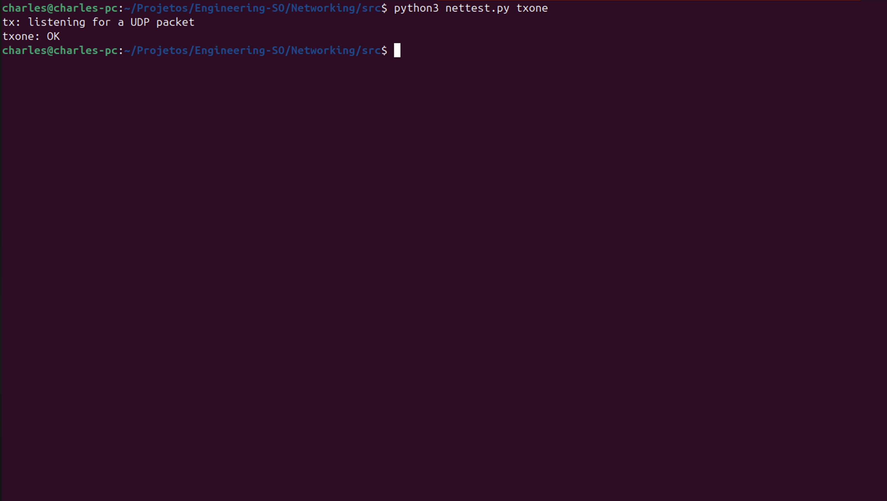
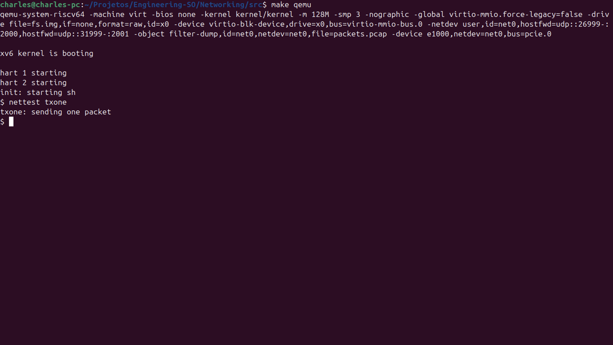
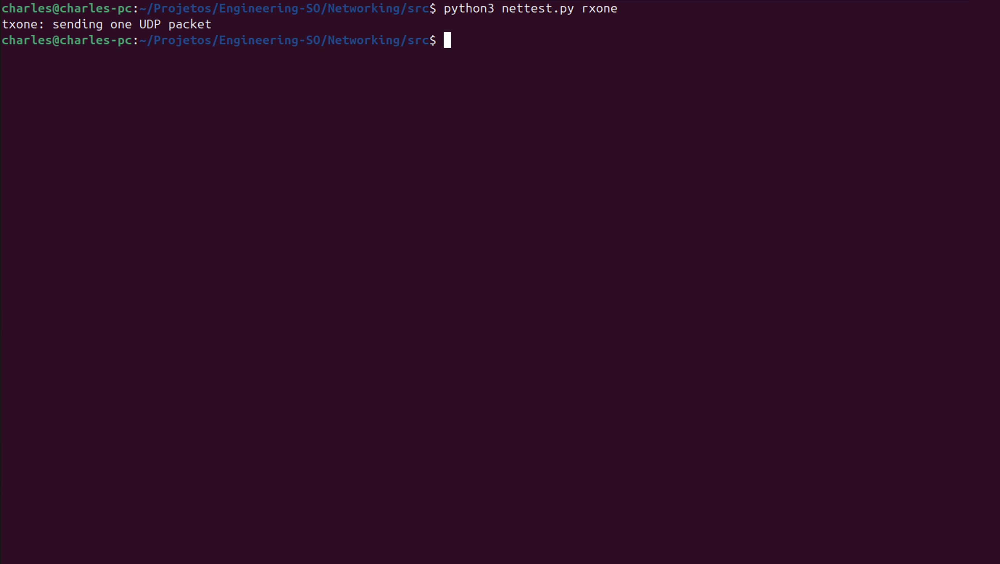
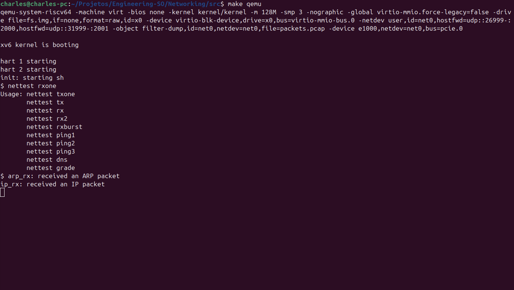
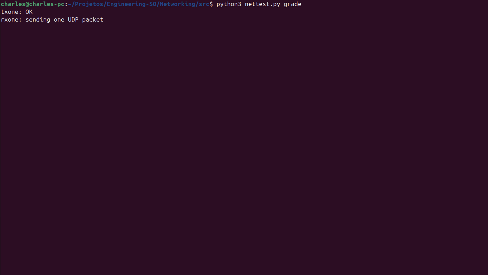
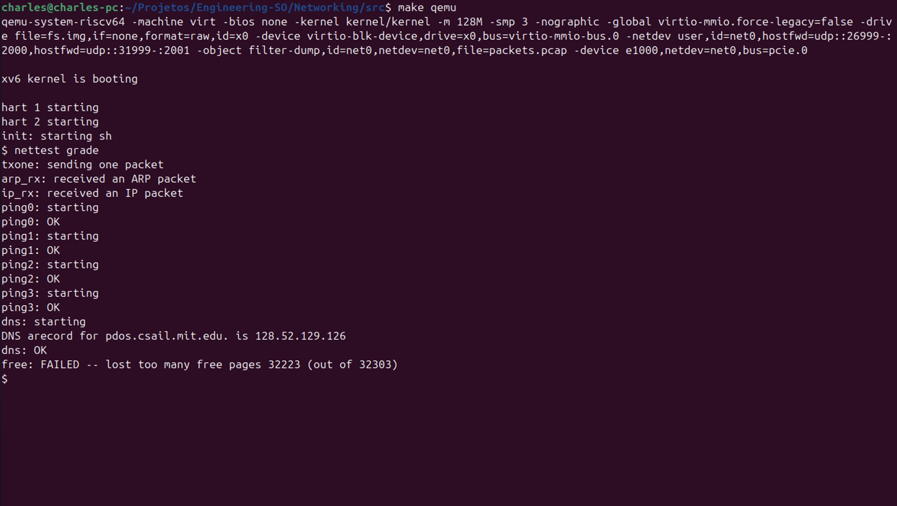

## Arquivo:
kernel/defs.h

## Codigo:
```c
// pci.c
void            pci_init();

// e1000.c
void            e1000_init(uint32 *);
void            e1000_intr(void);
int             e1000_transmit(char *, int);

// net.c
void            netinit(void);
void            net_rx(char *buf, int len);
```
## Explicação:
Adiciona protótipos públicos para inicialização PCI, driver e1000 e primitivas da pilha de rede, permitindo ligação cruzada entre módulos.

---

## Arquivo:
kernel/e1000.c

## Codigo:
```c
#include "net.h"

int
e1000_transmit(char *buf, int len)
{
  //
  // Your code here.
  //
  // buf contains an ethernet frame; program it into
  // the TX descriptor ring so that the e1000 sends it. Stash
  // a pointer so that it can be freed after send completes.
  //
  
  acquire(&e1000_lock);
  
  // Get the current tail index
  uint32 tdt = regs[E1000_TDT];
  
  // Check if the current descriptor is available (DD bit set means done)
  if (!(tx_ring[tdt].status & E1000_TXD_STAT_DD)) {
    // Ring is full, drop the packet
    release(&e1000_lock);
    return -1;
  }
  
  // Free the previous buffer if there was one
  if (tx_bufs[tdt]) {
    kfree(tx_bufs[tdt]);
  }
  
  // Store the new buffer pointer
  tx_bufs[tdt] = buf;
  
  // Set up the descriptor
  tx_ring[tdt].addr = (uint64)buf;
  tx_ring[tdt].length = len;
  tx_ring[tdt].cmd = E1000_TXD_CMD_EOP | E1000_TXD_CMD_RS;
  tx_ring[tdt].status = 0; // Clear the DD bit
  
  // Update the tail pointer to notify hardware
  regs[E1000_TDT] = (tdt + 1) % TX_RING_SIZE;
  
  release(&e1000_lock);
  return 0;
}

static void
e1000_recv(void)
{
  //
  // Your code here.
  //
  // Check for packets that have arrived from the e1000
  // Create and deliver a buf for each packet (using net_rx()).
  //
  
  while (1) {
    // Get the next receive descriptor to check
    uint32 rdt = (regs[E1000_RDT] + 1) % RX_RING_SIZE;
    
    // Check if there's a packet ready (DD bit set)
    if (!(rx_ring[rdt].status & E1000_RXD_STAT_DD)) {
      // No more packets ready
      break;
    }
    
    // Get the buffer and its length
    char *buf = rx_bufs[rdt];
    int len = rx_ring[rdt].length;
    
    // Deliver the packet to the network stack
    net_rx(buf, len);
    
    // Allocate a new buffer for this descriptor
    rx_bufs[rdt] = kalloc();
    if (!rx_bufs[rdt]) {
      panic("e1000_recv: kalloc failed");
    }
    
    // Reset the descriptor
    rx_ring[rdt].addr = (uint64)rx_bufs[rdt];
    rx_ring[rdt].status = 0; // Clear the DD bit
    
    // Update the tail pointer
    regs[E1000_RDT] = rdt;
  }
}
```
## Explicação:
Implementa **transmissão** via anel de descritores TX (verifica DD, programa `addr/length/cmd`, avança TDT e libera buffers antigos) e **recepção** iterando descritores RX prontos (DD), entregando frames ao *stack* via `net_rx`, reciclando buffers e atualizando RDT.

---

## Arquivo:
kernel/main.c

## Codigo:
```c
    netinit();

    pci_init();
```
## Explicação:
Inicializa a pilha de rede e, em seguida, configura dispositivos PCI (incluindo a NIC e1000) durante o *boot* do kernel.

---

## Arquivo:
kernel/net.c

## Codigo:
```c
// UDP port table
#define NPORT 16
struct port {
  uint16 port;
  int used;
  char *packets[16];  // Packet buffers
  int lengths[16];    // Packet lengths
  uint32 sips[16];    // Source IPs
  uint16 sports[16];  // Source ports
  int head;
  int tail;
  int count;
};

static struct port ports[NPORT];

void
netinit(void)
{
  initlock(&netlock, "netlock");
  
  // Initialize port table
  for(int i = 0; i < NPORT; i++) {
    ports[i].used = 0;
    ports[i].port = 0;
    ports[i].head = 0;
    ports[i].tail = 0;
    ports[i].count = 0;
    for(int j = 0; j < 16; j++) {
      ports[i].packets[j] = 0;
      ports[i].lengths[j] = 0;
      ports[i].sips[j] = 0;
      ports[i].sports[j] = 0;
    }
  }
}


uint64
sys_bind(void)
{
  int port;
  
  argint(0, &port);
    
  if(port < 0 || port > 65535)
    return -1;
    
  acquire(&netlock);
  
  // Check if port is already bound
  for(int i = 0; i < NPORT; i++) {
    if(ports[i].used && ports[i].port == port) {
      release(&netlock);
      return -1;  // Port already in use
    }
  }
  
  // Find free slot
  for(int i = 0; i < NPORT; i++) {
    if(!ports[i].used) {
      ports[i].used = 1;
      ports[i].port = port;
      ports[i].head = 0;
      ports[i].tail = 0;
      ports[i].count = 0;
      for(int j = 0; j < 16; j++) {
        ports[i].packets[j] = 0;
        ports[i].lengths[j] = 0;
        ports[i].sips[j] = 0;
        ports[i].sports[j] = 0;
      }
      release(&netlock);
      return 0;
    }
  }
  
  release(&netlock);
  return -1;  // No free slots
}

//
// unbind(int port)
// release any resources previously created by bind(port);
// from now on UDP packets addressed to port should be dropped.
//
uint64
sys_unbind(void)
{
  int port;
  
  argint(0, &port);
    
  acquire(&netlock);
  
  // Find and unbind the port
  for(int i = 0; i < NPORT; i++) {
    if(ports[i].used && ports[i].port == port) {
      // Free any queued packets
      for(int j = 0; j < 16; j++) {
        if(ports[i].packets[j]) {
          kfree(ports[i].packets[j]);
          ports[i].packets[j] = 0;
        }
      }
      ports[i].used = 0;
      ports[i].count = 0;
      release(&netlock);
      return 0;
    }
  }
  
  release(&netlock);
  return -1;  // Port not found
}


uint64
sys_recv(void)
{
  int dport;
  uint64 src_addr;
  uint64 sport_addr;
  uint64 buf_addr;
  int maxlen;
  
  argint(0, &dport);
  argaddr(1, &src_addr);
  argaddr(2, &sport_addr);
  argaddr(3, &buf_addr);
  argint(4, &maxlen);
    
  if(maxlen < 0)
    return -1;
    
  struct proc *p = myproc();
  
  acquire(&netlock);
  
  // Find the port
  int port_idx = -1;
  for(int i = 0; i < NPORT; i++) {
    if(ports[i].used && ports[i].port == dport) {
      port_idx = i;
      break;
    }
  }
  
  if(port_idx == -1) {
    release(&netlock);
    return -1;  // Port not bound
  }
  
  // Wait for a packet if queue is empty
  while(ports[port_idx].count == 0) {
    sleep(&ports[port_idx], &netlock);
  }
  
  // Get packet from queue
  char *packet = ports[port_idx].packets[ports[port_idx].head];
  int pkt_len = ports[port_idx].lengths[ports[port_idx].head];
  uint32 sip = ports[port_idx].sips[ports[port_idx].head];
  uint16 sport = ports[port_idx].sports[ports[port_idx].head];
  
  ports[port_idx].packets[ports[port_idx].head] = 0;
  ports[port_idx].head = (ports[port_idx].head + 1) % 16;
  ports[port_idx].count--;
  
  release(&netlock);
  
  // Copy data to user space
  int copy_len = maxlen < pkt_len ? maxlen : pkt_len;
  if(copyout(p->pagetable, buf_addr, packet, copy_len) < 0) {
    kfree(packet);
    return -1;
  }
  
  // Copy source IP and port
  if(copyout(p->pagetable, src_addr, (char*)&sip, sizeof(uint32)) < 0) {
    kfree(packet);
    return -1;
  }
  
  if(copyout(p->pagetable, sport_addr, (char*)&sport, sizeof(uint16)) < 0) {
    kfree(packet);
    return -1;
  }
  
  kfree(packet);
  return copy_len;
}


void
ip_rx(char *buf, int len)
{
  // don't delete this printf; make grade depends on it.
  static int seen_ip = 0;
  if(seen_ip == 0)
    printf("ip_rx: received an IP packet
");
  seen_ip = 1;

  //
  // Your code here.
  //
  
  struct ip *iphdr;
  struct udp *udphdr;
  
  if (len < sizeof(struct eth) + sizeof(struct ip))
    return;
    
  iphdr = (struct ip *) (buf + sizeof(struct eth));
  
  // Check if it's UDP
  if (iphdr->ip_p != IPPROTO_UDP)
    return;
    
  if (len < sizeof(struct eth) + sizeof(struct ip) + sizeof(struct udp))
    return;
    
  udphdr = (struct udp *) (buf + sizeof(struct eth) + sizeof(struct ip));
  
  uint16 dport = ntohs(udphdr->dport);
  uint16 sport = ntohs(udphdr->sport);
  uint32 sip = ntohl(iphdr->ip_src);
  uint16 ulen = ntohs(udphdr->ulen);
  
  acquire(&netlock);
  
  // Find the port
  for(int i = 0; i < NPORT; i++) {
    if(ports[i].used && ports[i].port == dport) {
      // Check if queue is full
      if(ports[i].count >= 16) {
        // Drop packet
        release(&netlock);
        return;
      }
      
      // Calculate payload offset and size
      int payload_offset = sizeof(struct eth) + sizeof(struct ip) + sizeof(struct udp);
      int payload_len = ulen - sizeof(struct udp);
      
      if(payload_len <= 0 || payload_offset + payload_len > len) {
        release(&netlock);
        return;
      }
      
      // Allocate buffer for the payload
      char *packet = kalloc();
      if(!packet) {
        release(&netlock);
        return;
      }
      
      // Copy payload
      char *payload = buf + payload_offset;
      memmove(packet, payload, payload_len);
      
      // Add to queue
      ports[i].packets[ports[i].tail] = packet;
      ports[i].lengths[ports[i].tail] = payload_len;
      ports[i].sips[ports[i].tail] = sip;
      ports[i].sports[ports[i].tail] = sport;
      ports[i].tail = (ports[i].tail + 1) % 16;
      ports[i].count++;
      
      // Wake up any waiting processes
      wakeup(&ports[i]);
      
      release(&netlock);
      return;
    }
  }
  
  release(&netlock);
}
```
## Explicação:
Implementa uma mini-pilha UDP no kernel: `netinit` e tabela de portas com fila circular; *syscalls* `bind/unbind/recv` para processos de usuário; e `ip_rx` que demultiplexa pacotes UDP recebidos, empilhando o payload por porta e acordando consumidores.


# Testes

```
$ cd src/
```

## Teste 1

Terminal 1:
```
$ python3 nettest.py txone
```



Terminal 2 (dentro do xv6):
```
$ nettest txone
```




## Teste 2

No Terminal 1:
```
$ python3 nettest.py rxone
```



No Terminal 2 (dentro do xv6):
```
$ nettest rxone
```



## Teste Final

No Terminal 1:
```
$ python3 nettest.py grade
```



No Terminal 2 (dentro do xv6):
```
$ nettest grade
```

