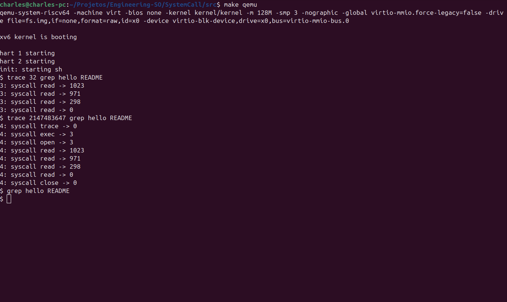
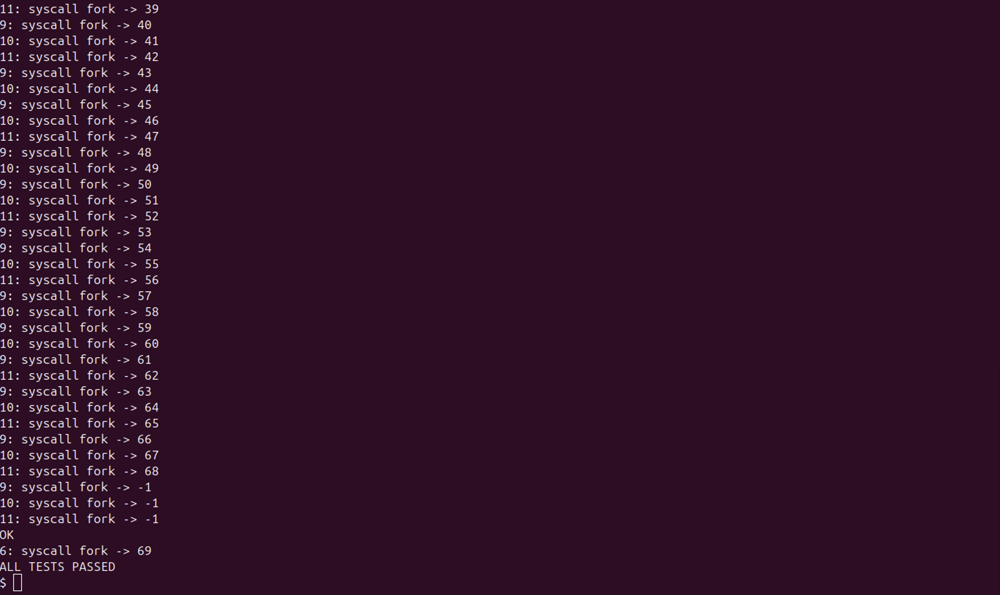
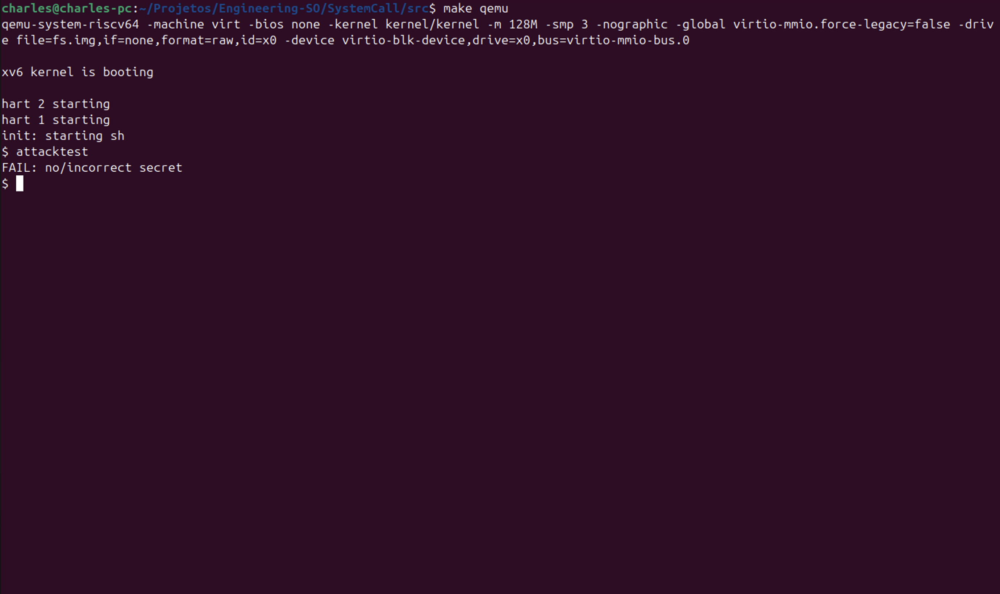

## Arquivo:
Makefile

## Codigo:
```
$U/_trace$U/_trace1$U/_trace2$U/_trace3
```
## Explicação:
Inclui os binários de teste/execução relacionados a *trace* na lista de programas de usuário. *(Observação: “Primeira versão (insegura)” sugere que estes alvos são provisórios para teste.)*

---

## Arquivo:
kernel/proc.c

## Codigo:
```c
// na função allocproc(void):

p->context.sp = p->kstack + PGSIZE;
p->trace_mask = 0; // INSERIR ESSA LINHA AQUI
return p;

// Na função fork(void):

safestrcpy(np->name, p->name, sizeof(p->name));
np->trace_mask = p->trace_mask; // INSERIR ESSA LINHA AQUI
pid = np->pid;
```
## Explicação:
Adiciona `trace_mask` com valor inicial 0 em novos processos e garante **herança** do `trace_mask` no `fork` para que o rastreamento permaneça ativo em filhos.

---

## Arquivo:
kernel/proc.h

## Codigo:
```c
// na struct proc:

int trace_mask;
```
## Explicação:
Campo por processo com *bitmask* para selecionar quais syscalls devem ser rastreadas.

---

## Arquivo:
Kernel/syscall.c

## Codigo:
```c
// Na declaração de variável:
extern uint64 sys_trace(void);

// Na declaração de vetor:
SYS_trace]   sys_trace,

// Criar esse vetor logo abaixo das declarações de variáveis:
static char *syscall_names[] = {
  [SYS_fork]    "fork",
  [SYS_exit]    "exit", 
  [SYS_wait]    "wait",
  [SYS_pipe]    "pipe",
  [SYS_read]    "read",
  [SYS_kill]    "kill",
  [SYS_exec]    "exec",
  [SYS_fstat]   "fstat",
  [SYS_chdir]   "chdir",
  [SYS_dup]     "dup",
  [SYS_getpid]  "getpid",
  [SYS_sbrk]    "sbrk",
  [SYS_sleep]   "sleep",
  [SYS_uptime]  "uptime",
  [SYS_open]    "open",
  [SYS_write]   "write",
  [SYS_mknod]   "mknod",
  [SYS_unlink]  "unlink",
  [SYS_link]    "link",
  [SYS_mkdir]   "mkdir",
  [SYS_close]   "close",
  [SYS_trace]   "trace",
};

// Alterar a syscall(void):
void
syscall(void)
{
  int num;
  struct proc *p = myproc();

  num = p->trapframe->a7;
  if(num > 0 && num < NELEM(syscalls) && syscalls[num]) {
    p->trapframe->a0 = syscalls[num]();
    
    // Verificar se deve rastrear esta syscall
    if(p->trace_mask & (1 << num)) {
      printf("%d: syscall %s -> %ld
", 
        p->pid, syscall_names[num], p->trapframe->a0);
    }
  } else {
    printf("%d %s: unknown sys call %d
", 
      p->pid, p->name, num);
    p->trapframe->a0 = -1;
  }
}
```
## Explicação:
Registra a nova syscall `trace`, introduz vetor `syscall_names[]` para *logging* legível e altera `syscall()` para imprimir chamadas cujo bit correspondente em `trace_mask` esteja ligado. *(Observação: a linha `SYS_trace]   sys_trace,` aparenta esperar um `[` inicial.)*

---

## Arquivo:
kernel/syscall.h

## Codigo:
```c
// Inserir essa definição no final do arquivo:
#define SYS_trace  23
```
## Explicação:
Define o número da syscall `trace` (23), que deve ser consistente em todo o sistema.

---

## Arquivo:
kernel/sysproc.c

## Codigo:
```c
// Criar esses métodos no final do arquivo:

/*
uint64
sys_explode(void) {
  char *s;
  char buf[100];
  argaddr(0, (uint64*)&s);

  if(copyinstr(myproc()->pagetable, buf, (uint64)s, sizeof(buf)) < 0)
    return -1;

  printf("%s
", buf);
  return 0;
}
*/

uint64
sys_trace(void)
{
  int mask;
  
  argint(0, &mask);
  
  // Validação opcional: verificar se a máscara é válida
  if(mask < 0) {
    return -1;
  }
  
  myproc()->trace_mask = mask;
  return 0;
}
```
## Explicação:
Implementa `sys_trace(int mask)`, que atualiza `trace_mask` do processo. Inclui (em comentário) uma versão segura ilustrativa de `sys_explode` usando `copyinstr` para validação de ponteiro.

---

## Arquivo:
user/trace1.c

## Codigo:
```c
#include "kernel/types.h"
#include "kernel/stat.h" 
#include "user/user.h"

int main() {
    printf("=== TESTE 1: Rastreamento de syscall READ ===
");
    printf("Equivalente a: trace 32 grep hello README
");
    printf("Mascara: 32 = 1<<5 (SYS_read)

");
    
    // Ativar trace apenas para read (32 = 1 << SYS_read)
    trace(32);
    
    // Simular o que grep faria: ler arquivo em chunks
    int fd = open("README", 0);
    if(fd < 0) {
        printf("Erro: nao conseguiu abrir README
");
        exit(1);
    }
    
    char buf[1024];
    int bytes_read;
    
    printf("Iniciando leitura do arquivo README...
");
    while((bytes_read = read(fd, buf, sizeof(buf))) > 0) {
        // Simular processamento (procurar por "hello")
        // Apenas lendo, o trace vai mostrar as chamadas read
    }
    
    close(fd);
    printf("
Teste 1 concluido!
");
    printf("Observe que apenas as syscalls READ foram rastreadas.
");
    exit(0);
}
```
## Explicação:
Programa de teste que ativa rastreamento apenas para `read` (bitmask 32) e lê `README` em blocos para gerar múltiplas chamadas.

---

## Arquivo:
user/trace2.c

## Codigo:
```c
#include "kernel/types.h"
#include "kernel/stat.h" 
#include "user/user.h"

int main() {
    printf("=== TESTE 2: Rastreamento de TODAS as syscalls ===
");
    printf("Equivalente a: trace 2147483647 grep hello README
");
    printf("Mascara: 2147483647 (todos os 31 bits baixos definidos)

");
    
    // Ativar trace para todas as syscalls
    trace(2147483647);
    
    printf("Iniciando operacoes com trace ativo...
");
    
    // Fazer várias operações diferentes para demonstrar rastreamento
    int fd = open("README", 0);
    if(fd >= 0) {
        char buf[100];
        int bytes = read(fd, buf, sizeof(buf));
        printf("Lidos %d bytes do arquivo
", bytes);
        close(fd);
    }
    
    // Fazer uma operação adicional
    int pid = getpid();
    printf("PID atual: %d
", pid);
    
    printf("
Teste 2 concluido!
");
    printf("Observe que TODAS as syscalls foram rastreadas:
");
    printf("- trace, open, read, close, getpid, write (do printf)
");
    exit(0);
}
```
## Explicação:
Ativa rastreamento para “todas” as syscalls (máscara com muitos bits ligados) e executa operações diversas para demonstrar a saída.

---

## Arquivo:
user/trace3.c

## Codigo:
```c
#include "kernel/types.h"
#include "kernel/stat.h" 
#include "user/user.h"

int main() {
    printf("=== TESTE 3: Rastreamento de FORK e heranca ===
");
    printf("Equivalente a: trace 2 usertests forkforkfork
");
    printf("Mascara: 2 = 1<<1 (SYS_fork)

");
    
    // Ativar trace apenas para fork
    trace(2);
    
    printf("Processo pai (PID %d) iniciando teste de fork...
", getpid());
    
    // Fazer múltiplos forks para demonstrar herança
    printf("
--- Criando processo filho 1 ---
");
    int pid1 = fork();
    if(pid1 == 0) {
        // Processo filho 1
        printf("Filho 1 (PID %d) executando...
", getpid());
        
        // Filho também pode fazer fork (herda o trace_mask)
        printf("Filho 1 criando neto...
");
        int pid_neto = fork();
        if(pid_neto == 0) {
            // Processo neto
            printf("Neto (PID %d) executando e terminando...
", getpid());
            exit(0);
        }
        wait(0); // Esperar o neto
        printf("Filho 1 terminando...
");
        exit(0);
    }
    
    printf("
--- Criando processo filho 2 ---
");  
    int pid2 = fork();
    if(pid2 == 0) {
        // Processo filho 2
        printf("Filho 2 (PID %d) executando e terminando...
", getpid());
        exit(0);
    }
    
    // Processo pai espera pelos filhos
    wait(0); // Esperar filho 1
    wait(0); // Esperar filho 2
    
    printf("
Teste 3 concluido!
");
    printf("Observe que:
");
    printf("- Todas as chamadas fork foram rastreadas
");
    printf("- Filhos herdaram o trace_mask do pai
");
    printf("- Netos também conseguem fazer fork rastreado
");
    exit(0);
}
```
## Explicação:
Demonstra **herança** do `trace_mask` no `fork` por pai/filhos/netos, produzindo saídas de rastreamento para as chamadas `fork`.

---

## Arquivo:
user/user.h

## Codigo:
```c
// Declarar esse parâmetro:
int trace(int);
```
## Explicação:
Protótipo de *userland* para a syscall `trace`.

---

## Arquivo:
user/usys.pl

## Codigo:
```c
// Declarar essa entrada:
entry("trace");
```
## Explicação:
Gera o *stub* de usuário para `trace` durante o build.

---

### Comandos sugeridos de teste (do enunciado)
```
make clean
make qemu
trace 32 grep hello README
trace 2147483647 grep hello README
trace 2 usertests forkforkfork
trace1
trace2
trace3

make clean
make grade
```

---

# =============================================================================
# Demonstração segura/insegura de `explode`

## Arquivo:
1. kernel/sysproc.c – implementação da syscall (Primeira versão (insegura))

## Codigo:
```c
uint64
sys_explode(void) {
  char *s;
  argaddr(0, (uint64*)&s);
  printf("%s
", s);  // ⚠️ usa ponteiro diretamente → inseguro
  return 0;
}

/*
uint64
sys_explode(void) {
  char *s;
  char buf[100];
  argaddr(0, (uint64*)&s);

  if(copyinstr(myproc()->pagetable, buf, (uint64)s, sizeof(buf)) < 0)
    return -1;

  printf("%s
", buf); // ⚠️ usa ponteiro seguro → correção
  return 0;
}
*/
```
## Explicação:
Mostra a versão **insegura** (usa ponteiro do usuário diretamente) e uma versão **segura** comentada que copia a string com `copyinstr` antes de imprimir.

---

## Arquivo:
2. kernel/syscall.c – registro da syscall

## Codigo:
```c
// Parte 1: declarar no topo
extern uint64 sys_explode(void);

// Parte 2: adicionar no vetor syscalls[]
[SYS_explode] sys_explode,
```
## Explicação:
Declara e registra `sys_explode` na tabela de handlers. *(Certifique-se de que o índice `SYS_explode` está definido.)*

---

## Arquivo:
3. kernel/syscall.h – número da syscall

## Codigo:
```c
#define SYS_explode 22
```
## Explicação:
Atribui número à syscall `explode` (22).

---

## Arquivo:
4. user/user.h – declaração para o usuário

## Codigo:
```c
int explode(char *s);
```
## Explicação:
Protótipo *userland* para `explode`.

---

## Arquivo:
5. user/usys.pl – entrada da syscall

## Codigo:
```perl
entry("explode");
```
## Explicação:
Gera o *stub* de sistema para `explode` no userland.

---

## Arquivo:
6. user/attack.c – programa malicioso

## Codigo:
```c
#include "kernel/types.h"
#include "user/user.h"

int main() {
  explode((char*)0xFFFFFFFF);  // ponteiro inválido
  exit(0);
}
```
## Explicação:
Programa de teste que passa um ponteiro inválido para `explode` — útil para evidenciar a falha da versão insegura e validar a correção com `copyinstr`.

# Testes

```
$ trace 32 grep hello README
$ trace 2147483647 grep hello README
$ grep hello README
```



```
$ trace 2 usertests forkforkfork
```



```
# attacktest
```



* Se o kernel travar ou reiniciar, o "ataque" funcionou.