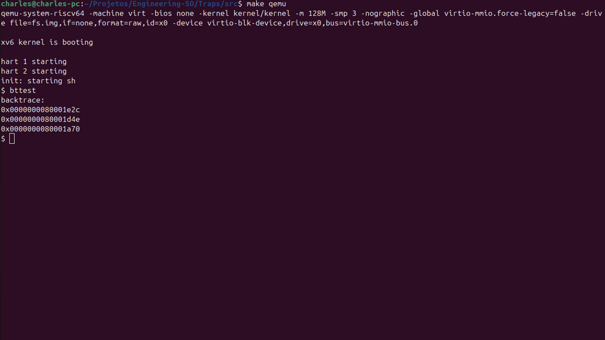
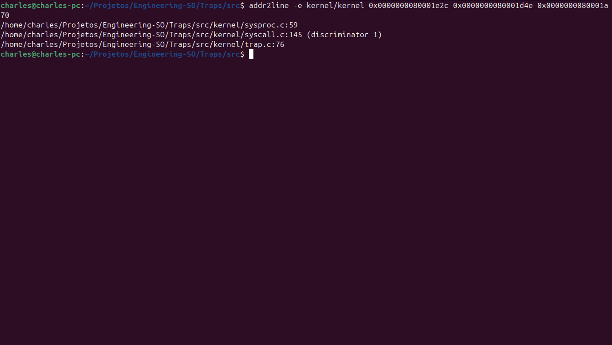
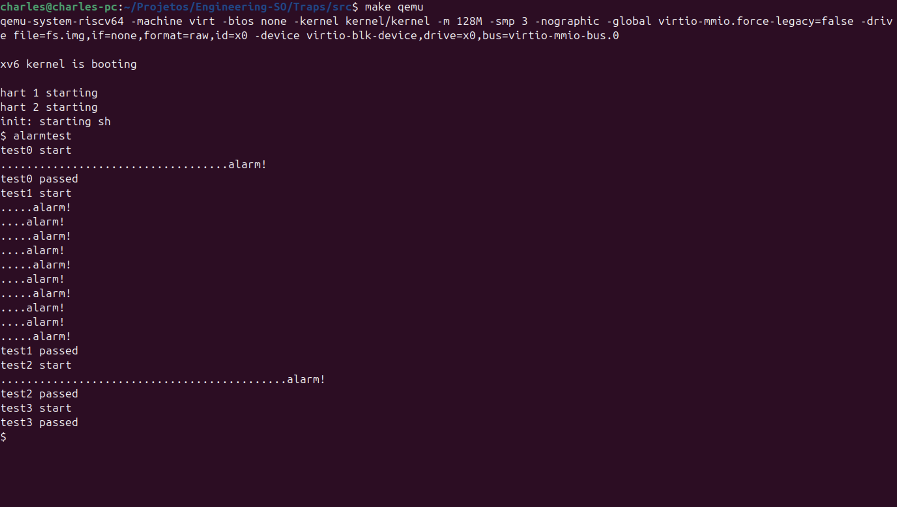

## Arquivo:
kernel/riscv.h

## Codigo:
```c
#ifndef __ASSEMBLER__
static inline uint64
r_fp()
{
  uint64 x;
  asm volatile("mv %0, s0" : "=r" (x) );
  return x;
}
#endif
```

## Explicação:
Cria função inline `r_fp()` para obter o **frame pointer (s0)**, necessário para implementar backtrace.

---

## Arquivo:
kernel/printf.c

## Codigo:
```c
void
backtrace(void)
{
  printf("backtrace:\n");
  
  uint64 fp = r_fp();  // Frame pointer atual (s0)
  uint64 page_start = PGROUNDDOWN(fp);
  uint64 page_end = page_start + PGSIZE;
  
  // Percorrer a stack usando frame pointers
  while (fp >= page_start && fp < page_end) {
    // Return address está em fp-8
    uint64 return_addr = *(uint64*)(fp - 8);
    printf("%p\n", (void*)return_addr);  // CAST PARA void*
    
    // Frame pointer anterior está em fp-16
    uint64 prev_fp = *(uint64*)(fp - 16);
    
    // Verificar se o próximo frame pointer é válido
    if (prev_fp <= fp || prev_fp >= page_end) {
      break;
    }
    
    fp = prev_fp;
  }
}

void
panic(char *s)
{
  pr.locking = 0;
  printf("panic: ");
  printf(s);
  printf("\n");
  backtrace();
  panicked = 1; // freeze uart output from other CPUs
  for(;;)
    ;
}
```

## Explicação:
Implementa função **`backtrace()`** para imprimir endereços de retorno da stack e integra no `panic()` para ajudar na depuração.

---

## Arquivo:
kernel/defs.h

## Codigo:
```c
// printf.c
void            printf(char*, ...);
void            panic(char*) __attribute__((noreturn));
void            printfinit(void);
void            backtrace(void);
```

## Explicação:
Adiciona protótipo de `backtrace()`.

---

## Arquivo:
kernel/sysproc.c

## Codigo:
```c
uint64
sys_sleep(void)
{
  int n;
  uint ticks0;

  backtrace();

  argint(0, &n);
  if(n < 0)
    n = 0;
  acquire(&tickslock);
  ticks0 = ticks;
  while(ticks - ticks0 < n){
    if(killed(myproc())){
      release(&tickslock);
      return -1;
    }
    sleep(&ticks, &tickslock);
  }
  release(&tickslock);
  return 0;
}

uint64
sys_sigalarm(void)
{
  int interval;
  uint64 handler;
  
  argint(0, &interval);
  argaddr(1, &handler);
  
  struct proc *p = myproc();
  p->alarm_interval = interval;
  p->alarm_handler = (void(*)())handler;
  p->alarm_ticks = 0;
  p->alarm_active = 0;
  
  return 0;
}

uint64
sys_sigreturn(void)
{
  struct proc *p = myproc();
  
  if (p->alarm_active && p->alarm_trapframe) {
    // Restore saved trapframe
    memmove(p->trapframe, p->alarm_trapframe, sizeof(struct trapframe));
    p->alarm_active = 0;
  }
  
  return 0;
}
```

## Explicação:
- `sys_sleep` agora chama `backtrace()` para demonstrar uso.
- Implementa syscalls **`sigalarm(interval, handler)`** e **`sigreturn()`** para alarmes baseados em ticks.

---

## Arquivo:
kernel/syscall.h

## Codigo:
```c
#define SYS_sigalarm 22
#define SYS_sigreturn 23
```

## Explicação:
Define números das novas syscalls.

---

## Arquivo:
kernel/syscall.c

## Codigo:
```c
extern uint64 sys_sigalarm(void);
extern uint64 sys_sigreturn(void);

static uint64 (*syscalls[])(void) = {
[SYS_fork]    sys_fork,
[SYS_exit]    sys_exit,
[SYS_wait]    sys_wait,
[SYS_pipe]    sys_pipe,
[SYS_read]    sys_read,
[SYS_kill]    sys_kill,
[SYS_exec]    sys_exec,
[SYS_fstat]   sys_fstat,
[SYS_chdir]   sys_chdir,
[SYS_dup]     sys_dup,
[SYS_getpid]  sys_getpid,
[SYS_sbrk]    sys_sbrk,
[SYS_sleep]   sys_sleep,
[SYS_uptime]  sys_uptime,
[SYS_open]    sys_open,
[SYS_write]   sys_write,
[SYS_mknod]   sys_mknod,
[SYS_unlink]  sys_unlink,
[SYS_link]    sys_link,
[SYS_mkdir]   sys_mkdir,
[SYS_close]   sys_close,
[SYS_sigalarm] sys_sigalarm,
[SYS_sigreturn] sys_sigreturn,
};
```

## Explicação:
Registra `sigalarm` e `sigreturn` no vetor de syscalls.

---

## Arquivo:
user/usys.pl

## Codigo:
```c
entry("sigalarm");
entry("sigreturn");
```

## Explicação:
Cria *stubs* de usuário para `sigalarm` e `sigreturn`.

---

## Arquivo:
user/user.h

## Codigo:
```c
int sigalarm(int ticks, void (*handler)());
int sigreturn(void);
```

## Explicação:
Protótipos para chamadas de usuário.

---

## Arquivo:
kernel/proc.h

## Codigo:
```c
int alarm_interval;          // Alarm interval in ticks
void (*alarm_handler)();     // Alarm handler function
int alarm_ticks;             // Ticks since last alarm
struct trapframe *alarm_trapframe; // Saved trapframe for alarm
int alarm_active;            // Whether alarm is currently active
```

## Explicação:
Novos campos na `struct proc` para suportar alarmes por processo.

---

## Arquivo:
kernel/proc.c

## Codigo:
```c
// Em allocproc(void):
  p->alarm_interval = 0;
  p->alarm_handler = 0;
  p->alarm_ticks = 0;
  p->alarm_trapframe = 0;
  p->alarm_active = 0;

// Em freeproc(struct proc *p):
  if(p->alarm_trapframe)
    kfree((void*)p->alarm_trapframe);
  p->alarm_trapframe = 0;
  p->alarm_interval = 0;
  p->alarm_handler = 0;
  p->alarm_ticks = 0;
  p->alarm_active = 0;
```

## Explicação:
Inicializa e libera memória associada aos alarmes ao criar/destruir processos.

---

## Arquivo:
kernel/trap.c

## Codigo:
```c
if(which_dev == 2){
    // ADICIONAR LÓGICA DO ALARM:
    struct proc *p = myproc();
    
    if(p->alarm_interval > 0) {
      p->alarm_ticks++;
      
      if(p->alarm_ticks >= p->alarm_interval && !p->alarm_active) {
        // Save current trapframe
        if(p->alarm_trapframe == 0) {
          p->alarm_trapframe = (struct trapframe*)kalloc();
          if(p->alarm_trapframe == 0) {
            // Out of memory, skip alarm
            p->alarm_ticks = 0;
            yield();
            goto end;
          }
        }
        
        memmove(p->alarm_trapframe, p->trapframe, sizeof(struct trapframe));
        
        // Set up to call alarm handler
        p->trapframe->epc = (uint64)p->alarm_handler;
        p->alarm_ticks = 0;
        p->alarm_active = 1;
      }
    }
    
    yield();
}
```

## Explicação:
Durante interrupção de timer (`which_dev==2`), controla ticks e dispara handler de alarme, salvando/restaurando `trapframe`.

---

## Arquivo:
Makefile

## Codigo:
```make
$U/_alarmtest\ 
```

## Explicação:
Adiciona programa de usuário `alarmtest` para testar a syscall `sigalarm`.


# Testes

No Terminal 1 (dentro do xv6):
```
$ bttest
```



No Terminal 2:
```
$ addr2line -e kernel/kernel 0x0000000080001e2c 0x0000000080001d4e 0x0000000080001a70
```



```
$ alarmtest
```

